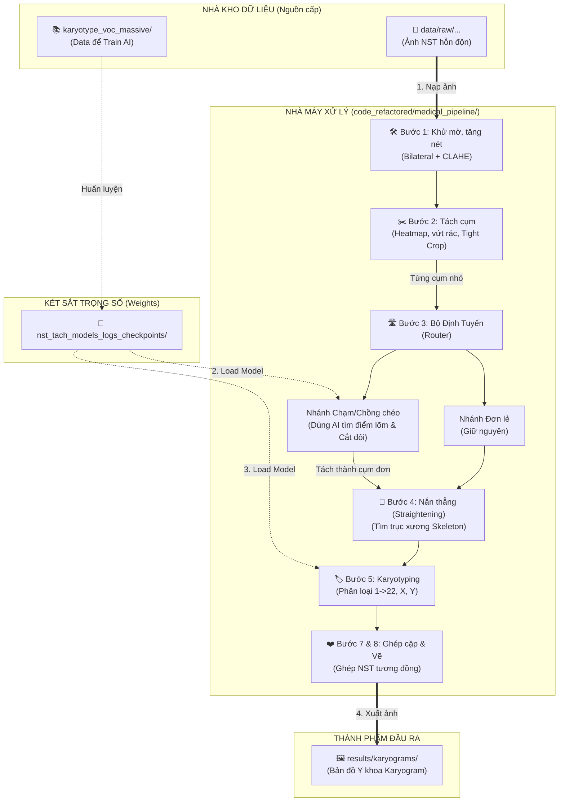

# BÁO CÁO CẤU TRÚC VÀ LUỒNG CHẠY PIPELINE (VISUALIZED)
*Bản báo cáo giải phẫu chi tiết hệ sinh thái dự án `dự_án_NTS`*

## 1. GIẢI PHẪU CÁC THƯ MỤC TRONG DỰ ÁN

Dựa trên cấu trúc chuẩn xác mà chúng ta vừa xây dựng, mỗi thư mục đóng một vai trò riêng biệt, không giẫm chân lên nhau:

### A. Phân hệ Lưu trữ Dữ liệu & Trọng số (Nằm ngoài cùng)
Đây là các "nhà kho" khổng lồ, nằm ngoài source code để không làm nặng Git:
- 📁 **`data/`**: Nhà kho chứa ảnh đầu vào (Raw Images). Khi chạy dự án, pipeline sẽ "mở cửa" kho này để lấy ảnh gốc (ví dụ: `9250100210.1.k.JPG`) đưa vào xử lý.
- 📁 **`karyotype_voc_massive/`**: Thư viện chứa hàng chục ngàn ảnh nhiễm sắc thể đã được bác sĩ gán nhãn (Label). Data này ĐỘC QUYỀN dùng cho việc huấn luyện (Train) AI.
- 📁 **`nst_tach_models_logs_checkpoints/`**: Két sắt chứa "bộ não" của AI. Khi Train xong, trọng số (`.pth`, `.h5`) sẽ được ném vào đây. Khi chạy Pipeline thực tế, code sẽ vào đây để load não lên phán đoán.

### B. Phân hệ Trái tim Thuật toán (Thư mục `code_refactored/`)
Đây là cỗ máy nhà máy chế biến:
- 📁 **`medical_pipeline/`**: Dây chuyền sản xuất chính. Chứa các Bước 1, 2, 3, 4, 5, 7, 8. Ảnh từ `data/` đi vào đầu này và ra thành phẩm.
- 📁 **`ai_training/`**: Khu vực phòng thí nghiệm. Nơi chứa các file script để cày cuốc (train) data từ thư mục VOC, sinh ra model mới.
- 📁 **`models/` & `pwarp/`**: Các bản thiết kế kiến trúc mạng (Swin, U-Net) và thư viện nắn thẳng hình học phức tạp.
- 📁 **`utils/`**: Các công cụ kìm búa lặt vặt (vẽ grid, IO ảnh).
- 📁 **`results/`**: Thành phẩm cuối cùng (Bản đồ Karyogram) sẽ được xuất từ nhà máy và lưu trữ ở đây.

### C. Phân hệ Quản trị (Root files)
- 📄 **`main.py`**: Nút bấm Start duy nhất của toàn nhà máy.
- 📄 **`.env`**: La bàn định hướng cho Editor (VSCode) không bị mù đường.
- 📄 **`pyproject.toml` / `uv.lock` / `.venv`**: Hệ thống vận hành năng lượng (thư viện Python) cho toàn dự án.

---

## 2. TRỰC QUAN HÓA LUỒNG CHẠY PIPELINE (VISUAL PIPELINE)

Sơ đồ dưới đây trình bày luồng Data đi từ đâu, qua các trạm nào và xuất ra đâu. 
*(Nếu bạn xem file này trên VSCode, hãy mở chế độ Preview Markdown để xem được sơ đồ vẽ tự động nhé).*

## 3. TÓM TẮT CÁCH GỌI LỆNH TỪ BÊN NGOÀI
Khi bạn đứng ở thư mục gốc `dự_án_NTS` và gõ lệnh:
`uv run main.py --step full_pipeline --input-dir data/raw/103064.jpg`

Điều gì sẽ xảy ra?
1. Lệnh truyền vào `main.py`. 
2. `main.py` đọc thông số và gọi hàm xử lý bên trong `code_refactored/medical_pipeline/...`
3. Pipeline tự động thò tay ra ngoài thư mục `data/raw/` bốc bức ảnh `103064.jpg` vào.
4. Chạy qua B1, B2. Khi đến B3 và B5, pipeline tự động thò tay vào `nst_tach_models_logs_checkpoints/` móc cái Model AI ra để suy luận.
5. Chạy tiếp đến B8, thợ vẽ xong bản đồ sẽ đẩy thẳng kết quả ra thư mục `code_refactored/results/karyograms/`.
